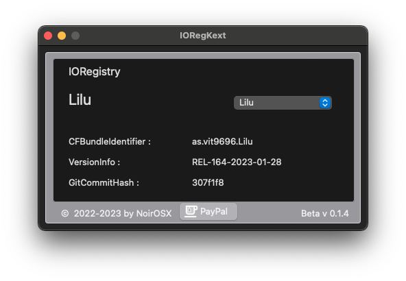

# IORegKext

-----

### Tool reads kext commit from the ioReg

To better test kexten from one release date to another (REL-xx-yyyy-mm-dd), there is no way to determine the version.
This is given with the version of the existing commit.

Danger! 
The commit part only goes from built kexts with RepoBuild

## Discussion

## Credits
* ITzTravelInTime für TINUIORegistry
* The OSx86-Gang beim Input & fleißigen Testen
